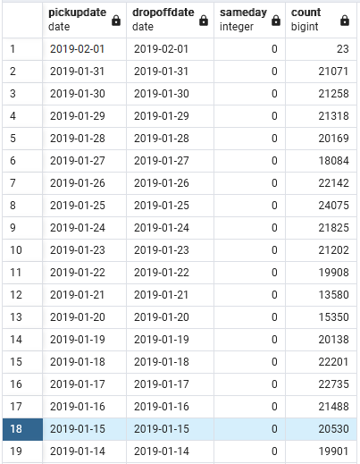
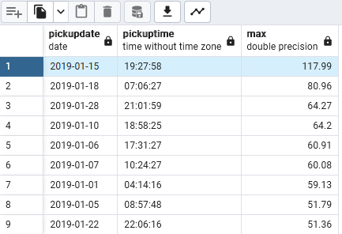
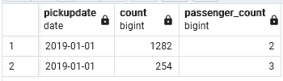
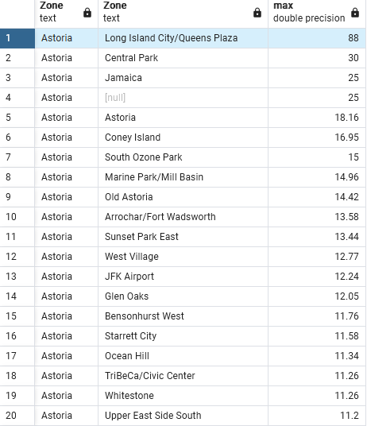

## Week 1 Homework Solutions - jrivas404@gmail.com

Please see my solutions to week 1 homework assignments below, with screenshots of my SQL Query Results

## Question 1. Knowing docker tags

Run the command to get information on Docker 

- ```docker --help```

Now run the command to get help on the "docker build" command

Which tag has the following text? - *Write the image ID to the file* 
```
- --iidfile string
```

## Question 2. Understanding docker first run 

Run docker with the python:3.9 image in an interactive mode and the entrypoint of bash.
Now check the python modules that are installed ( use pip list). 
How many python packages/modules are installed?

```
- 3 Modules installed:
    - pip        22.3.1
    - setuptools 58.1.0
    - wheel      0.38.4
```

# Prepare Postgres

Run Postgres and load data as shown in the videos
We'll use the green taxi trips from January 2019:

```wget https://github.com/DataTalksClub/nyc-tlc-data/releases/download/green/green_tripdata_2019-01.csv.gz```

You will also need the dataset with zones:

```wget https://s3.amazonaws.com/nyc-tlc/misc/taxi+_zone_lookup.csv```

Download this data and put it into Postgres (with jupyter notebooks or with a pipeline)


## Question 3. Count records 

How many taxi trips were totally made on January 15?

Tip: started and finished on 2019-01-15. 

Remember that `lpep_pickup_datetime` and `lpep_dropoff_datetime` columns are in the format timestamp (date and hour+min+sec) and not in date.
```
- 20530
```

```sql
SELECT    
    CAST(lpep_pickup_datetime AS DATE) as pickupdate,
	CAST(lpep_dropoff_datetime AS DATE) as dropoffdate,
	(CAST(lpep_pickup_datetime AS DATE) - CAST(lpep_dropoff_datetime AS DATE)) AS sameday,
	COUNT (1)
FROM green_taxi_data
WHERE (CAST(lpep_pickup_datetime AS DATE) - CAST(lpep_dropoff_datetime AS DATE))='0'
GROUP BY 1,2
ORDER BY (1) DESC
```


## Question 4. Largest trip for each day

Which was the day with the largest trip distance
Use the pick up time for your calculations.

```
- 2019-01-15
```

```sql
SELECT 
	CAST(lpep_pickup_datetime AS DATE) as pickupdate,
	CAST(lpep_pickup_datetime AS TIME) as pickuptime,
	MAX(trip_distance)
FROM green_taxi_data
GROUP BY 1,2
ORDER BY 3 DESC
```



## Question 5. The number of passengers

In 2019-01-01 how many trips had 2 and 3 passengers?

``` 
- 2: 1282 ; 3: 254
```

```sql
SELECT 
	CAST(lpep_pickup_datetime AS DATE) as pickupdate,
	CAST(lpep_pickup_datetime AS TIME) as pickuptime,
	MAX(trip_distance)
FROM green_taxi_data
GROUP BY 1,2
ORDER BY 3 DESC
```



## Question 6. Largest tip

For the passengers picked up in the Astoria Zone which was the drop off zone that had the largest tip?
We want the name of the zone, not the id.

Note: it's not a typo, it's `tip` , not `trip`

```
- Long Island City/Queens Plaza
```

```sql
SELECT
	zpu."Zone",
	zdo."Zone",
	MAX(tip_amount)
	
FROM green_taxi_data g 
	RIGHT JOIN taxi_zones zpu
		ON g."PULocationID" = zpu."LocationID"
	LEFT JOIN taxi_zones zdo
		ON g."DOLocationID" = zdo."LocationID"
WHERE zpu."Zone"='Astoria' 
GROUP BY 1,2
ORDER BY 3 DESC
```
